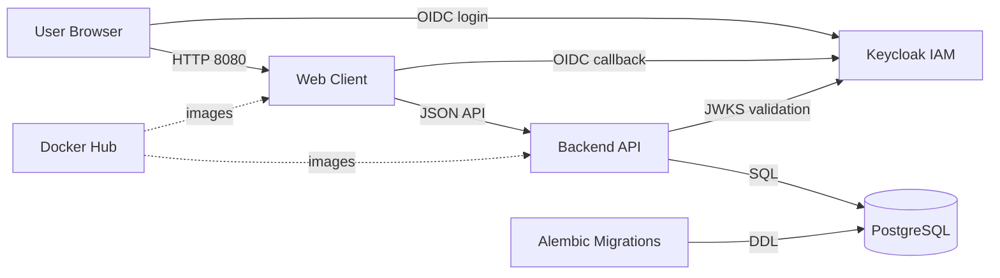

# Inventory Lifecycle Engine

[](https://github.com/TechCeo/inventory-lifecycle-engine/actions/workflows/backend.yml)
[](https://github.com/TechCeo/inventory-lifecycle-engine/actions/workflows/frontend.yml)
[](https://github.com/TechCeo/inventory-lifecycle-engine/actions/workflows/integration.yml)
[](https://github.com/TechCeo/inventory-lifecycle-engine/actions/workflows/docker-build.yml)

Inventory Lifecycle Engine is a containerized full-stack inventory and asset lifecycle
platform for tracking products, storage locations, stock batches, expiration windows,
and depleted inventory. The system combines a React/Vite web client, FastAPI service
layer, PostgreSQL persistence, Alembic migrations, and Keycloak-backed OIDC login.

## Current stack

- Backend: FastAPI, SQLAlchemy, Pydantic, Alembic, PostgreSQL
- Frontend: React, TypeScript, Vite, React Router, TanStack Query, React Hook Form, Zod
- Auth: OIDC with Authorization Code + PKCE on the web client
- Runtime: Docker Compose with API, migrations, PostgreSQL, Keycloak, and web services

## Architecture overview

Local development runs as a Dockerized web platform:



The browser signs in through Keycloak using Authorization Code + PKCE. After login,
the web client sends a Bearer token to the FastAPI API. The API validates token
issuer, audience, expiry, and signature using Keycloak's JWKS endpoint over the
Docker network, then reads and writes inventory data in PostgreSQL.

Architecture evidence:

- Docker Compose defines `db`, `keycloak`, `migrate`, `api`, and `web` services and
  the `inventory-lifecycle-engine` project name in `docker-compose.yml`.
- The API service exposes port `8000`, depends on completed migrations and Keycloak,
  and uses OIDC issuer/audience/JWKS settings from environment variables.
- The web service exposes port `8080` and is configured with Vite OIDC/API build
  arguments.
- The backend image is a Python 3.13 multi-stage FastAPI container; the frontend image
  is a Node 22 build stage served by Nginx.
- The React auth provider uses `oidc-client-ts` with Authorization Code flow, PKCE
  supplied by the Keycloak client, and stores OIDC state in browser local storage.

## Repository layout

```text
backend/
  alembic/                 # Versioned database migrations
  app/
    api/routes/            # FastAPI endpoint modules
    cli/                   # Operational CLIs, including legacy SQLite importer
    core/                  # Environment configuration and security helpers
    db/models/             # SQLAlchemy models
    domain/                # Lifecycle values and roles
    repositories/          # SQLAlchemy query layer
    schemas/               # Documented Pydantic API contracts
    services/              # Business rules and authorization orchestration
  tests/                   # Backend integration tests

frontend/
  src/                     # React TypeScript web client
  Dockerfile               # Nginx-served production build

Dockerfile                # FastAPI production/test image
keycloak/                 # Local development identity-provider realm import
docker-compose.yml        # DB, Keycloak, migration, API, web, and test services
```

## Prerequisites

Install:

- Docker Desktop with Docker Compose v2
- Git
- Node.js 22+ only if you want to run the frontend outside Docker
- Python 3.13+ only if you want to run backend commands outside Docker

The recommended onboarding path is Docker Compose; local Node/Python installs are
optional for day-to-day manual testing.

## Docker image names

The active container images use the modern repository naming convention:

| Component | Image | Published tags | Registry link |
| --- | --- | --- | --- |
| API and migration image | `techceo/inventory-lifecycle-engine-api` | `latest`, `0.1.0` | [Docker Hub](https://hub.docker.com/r/techceo/inventory-lifecycle-engine-api) |
| API test image | `techceo/inventory-lifecycle-engine-api-test` | `latest`, `0.1.0` | [Docker Hub](https://hub.docker.com/r/techceo/inventory-lifecycle-engine-api-test) |
| Web image | `techceo/inventory-lifecycle-engine-web` | `latest`, `0.1.0` | [Docker Hub](https://hub.docker.com/r/techceo/inventory-lifecycle-engine-web) |

The Compose file builds these images locally with the `:local` tag. GitHub Actions
build verification uses the same names with the `:ci` tag. Public Docker Hub images
are published as `:latest` and versioned release tags such as `:0.1.0`.

## Local setup with Docker Compose

From the repository root:

```powershell
Copy-Item .env.example .env
```

On macOS/Linux:

```bash
cp .env.example .env
```

Review `.env` before starting the stack. The checked-in `.env.example` is safe for
local development defaults, while `.env` is intentionally ignored so local secrets,
ports, and provider settings do not get committed.

Build and start the full application:

```powershell
docker compose up --build
```

Or run it in the background:

```powershell
docker compose up -d --build db keycloak migrate api web
```

Check container health:

```powershell
docker compose ps
```

Local URLs:

- Web app: http://localhost:8080
- Local Keycloak: http://localhost:8081
- API docs: http://localhost:8000/docs
- Liveness: http://localhost:8000/health
- Readiness: http://localhost:8000/ready

If your network intercepts TLS certificates during local image builds, prefer installing
your organization/root CA. As a temporary local-only workaround:

```powershell
docker compose build --build-arg PIP_TRUSTED_HOST="pypi.org files.pythonhosted.org" --build-arg NPM_CONFIG_STRICT_SSL=false
```

Do not use those relaxed build settings in CI or production.

## Authentication flow: local login with Docker Keycloak

The default local setup uses a Dockerized Keycloak identity provider so you can
manually test the web client without configuring Google or another external provider.

Seeded local credentials:

| Purpose | Value |
| --- | --- |
| Keycloak admin URL | http://localhost:8081 |
| Keycloak admin user | `admin` |
| Keycloak admin password | `admin` |
| App test user | `owner@example.com` |
| App test password | `password` |
| Realm | `expiry-notification` |
| Frontend client | `expiry-notification-web` |

Start or refresh the full local stack:

```powershell
docker compose up -d --build db keycloak migrate api web
```

Then test the login flow:

1. Open the web client: http://localhost:8080.
2. Click **Continue with SSO**.
3. Keycloak redirects you to the local realm login page.
4. Sign in with the seeded app user:

   ```text
   owner@example.com
   password
   ```

5. After Keycloak redirects back to the app, create your first organization if one
   does not already exist.
6. You are now the organization owner and can manually test products, locations,
   batches, expiring inventory, expired inventory, and depleted inventory.

Optional: open the Keycloak admin console at http://localhost:8081 and sign in with
`admin` / `admin` to inspect the seeded realm, client, and user.

Local OIDC wiring:

```env
OIDC_ISSUER_URL=http://localhost:8081/realms/expiry-notification
OIDC_AUDIENCE=expiry-notification-web
OIDC_JWKS_URL=http://keycloak:8080/realms/expiry-notification/protocol/openid-connect/certs
VITE_OIDC_AUTHORITY=http://localhost:8081/realms/expiry-notification
VITE_OIDC_CLIENT_ID=expiry-notification-web
VITE_OIDC_API_TOKEN=id_token
```

The issuer is the browser-visible Keycloak URL, while the JWKS URL uses the Docker
network hostname so the API container can fetch signing keys.

Because the web client is statically built, changes to `VITE_*` variables require a
web image rebuild:

```powershell
docker compose up -d --build web
```

If you change `keycloak/realm-export.json` after Keycloak has already imported the realm,
reset the Keycloak volume and start again:

```powershell
docker compose down
docker volume rm inventory-lifecycle-engine_keycloak_data
docker compose up -d --build db keycloak migrate api web
```

## Backend API

All versioned inventory endpoints require an OIDC Bearer token. Health endpoints
remain public. The API validates token signature, issuer, audience, expiration, subject,
and asymmetric signing algorithm through the configured JWKS endpoint.

For Google login, the browser sends Google's `id_token` to the API. That token is a
JWT whose audience is your Google OAuth Web client ID. For providers that issue a
custom API access token, set `VITE_OIDC_API_TOKEN=access_token` instead.

Core resources:

| Resource | Route | Notes |
| --- | --- | --- |
| Organizations | `/api/v1/organizations` | Tenant boundary and inventory owner |
| Products | `/api/v1/products` | Organization-scoped catalog and SKU |
| Locations | `/api/v1/locations` | Warehouses, shops, and storage areas |
| Batches | `/api/v1/batches` | Core inventory unit with quantity and expiry |
| Identity | `/api/v1/me` | Current user, memberships, and roles |

Collection endpoints return `items`, `total`, `limit`, and `offset`. Batch lists support
filters such as `organization_id`, `product_id`, `location_id`, `status`, `expiry_date`,
`expires_from`, and `expires_to`.

## Roles

| Role | Read inventory | Manage inventory | Manage members | Delete organization |
| --- | --- | --- | --- | --- |
| `viewer` | Yes | No | No | No |
| `inventory_manager` | Yes | Yes | No | No |
| `admin` | Yes | Yes | Yes | No |
| `owner` | Yes | Yes | Yes | Yes |

The API prevents removal or demotion of the final organization owner. Inventory,
organization, and membership mutations create audit events in the same PostgreSQL
transaction.

## Frontend

The React web client includes:

- Login and OIDC/PKCE callback handling
- Organization selection
- Inventory dashboard
- Product, location, and batch workflows
- Pagination and filtering
- Expiring-soon, expired, and depleted inventory views
- Responsive layouts
- Loading, empty, validation, and error states
- Role-aware write controls

Run locally from `frontend/`:

```powershell
npm install
npm run dev
```

Build and lint:

```powershell
npm run build
npm run lint
```

## Google login setup

Google is a good public login provider because many users already have an account and
Google supports OpenID Connect. Use Docker Keycloak for local/manual development first,
then switch these settings when you are ready to test public login.

1. Create or select a project in Google Cloud Console.
2. Configure the OAuth consent screen.
3. Create an OAuth Client ID with application type `Web application`.
4. Add this authorized redirect URI:

   ```text
   http://localhost:8080/auth/callback
   ```

5. Copy the generated Google client ID into `.env`.

Example `.env` values:

```env
OIDC_ISSUER_URL=https://accounts.google.com
OIDC_AUDIENCE=your-google-client-id.apps.googleusercontent.com
OIDC_JWKS_URL=https://www.googleapis.com/oauth2/v3/certs
OIDC_ALGORITHMS=RS256

VITE_AUTH_MODE=oidc
VITE_OIDC_API_TOKEN=id_token
VITE_OIDC_AUTHORITY=https://accounts.google.com
VITE_OIDC_CLIENT_ID=your-google-client-id.apps.googleusercontent.com
VITE_OIDC_REDIRECT_URI=http://localhost:8080/auth/callback
VITE_OIDC_POST_LOGOUT_REDIRECT_URI=http://localhost:8080/
VITE_OIDC_SCOPE=openid profile email
```

Because the web client is statically built with Vite, rebuild the web image after
changing any `VITE_*` value:

```powershell
docker compose up -d --build api web
```

The first successful Google sign-in auto-creates a local user profile. That user can
then create an organization and becomes its first owner.

## Legacy SQLite importer

The importer is idempotent and supports dry-run mode, validation, duplicate prevention,
source/destination totals, and machine-readable JSON reports.

Supported legacy mappings:

```text
students.roll/mobile/sem/address -> Product + Batch
products.id/expiry_date/quantity/remarks -> Product + Batch
```

Dry-run against a local SQLite database copy through Docker:

```powershell
docker compose run --rm -v "${PWD}\database.db:/tmp/database.db:ro" api python -m app.cli.import_legacy_sqlite --source /tmp/database.db --source-table auto --organization-name "Legacy Import" --organization-slug legacy-import --location-name "Legacy Default Location" --location-code LEGACY --dry-run
```

Final import after testing a DB copy:

```powershell
docker compose run --rm -v "${PWD}\database.db:/tmp/database.db:ro" api python -m app.cli.import_legacy_sqlite --source /tmp/database.db --source-table auto --organization-name "Legacy Import" --organization-slug legacy-import --location-name "Legacy Default Location" --location-code LEGACY --report-path /tmp/legacy-import-report.json
```

If you want an existing authenticated user to own the imported organization, pass
`--owner-email someone@example.com`; that user must have authenticated once with a
verified OIDC email.

## Build and test locally

Validate the Compose file:

```powershell
docker compose --profile test config --quiet
```

Build the production API and web images:

```powershell
docker compose build api web
```

Build the test image:

```powershell
docker compose build test
```

Run the full containerized backend integration test path with disposable PostgreSQL:

```powershell
docker compose --profile test run --build --rm test
```

Clean up disposable integration-test containers and volumes:

```powershell
docker compose --profile test down --volumes --remove-orphans
```

## Tests

Frontend:

```powershell
cd frontend
npm run lint
npm run build
```

Backend with disposable PostgreSQL:

```powershell
docker compose --profile test run --build --rm test sh -c "ruff check --no-cache app tests alembic && python -m pytest -q -p no:cacheprovider"
```

Clean up disposable test containers:

```powershell
docker compose --profile test rm --stop --force test test-migrate test-db
```

## Migrations

Run migration commands from `backend/`:

```powershell
alembic current
alembic upgrade head
alembic revision --autogenerate -m "describe the schema change"
alembic downgrade -1
```

Application startup never calls `create_all`; deployed schema changes must pass through
reviewable Alembic revisions.

`database.db` is intentionally ignored and removed from Git tracking. Keep a private copy
only long enough to validate and complete the PostgreSQL import.
