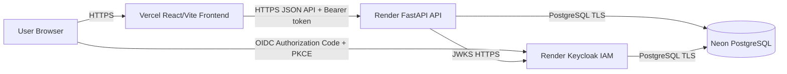
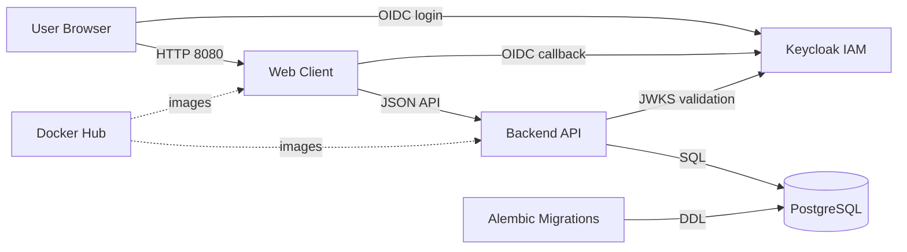
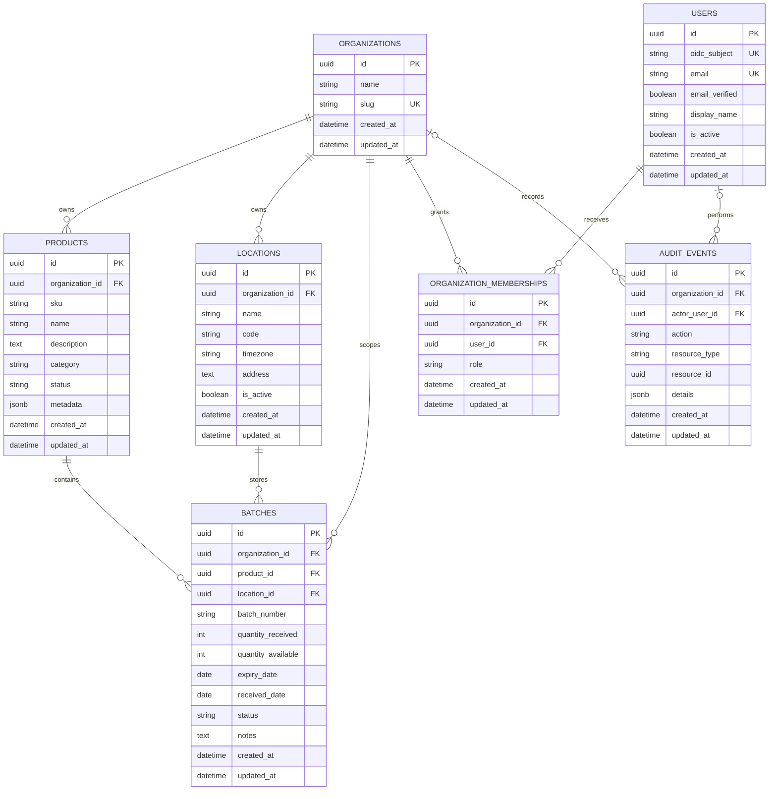
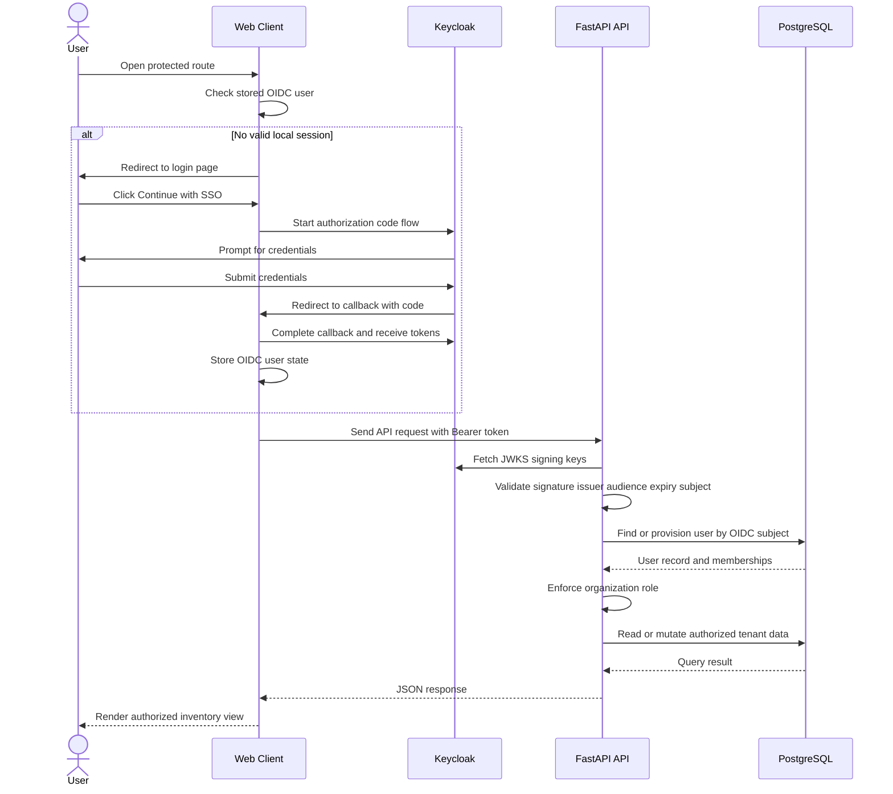

# Inventory Lifecycle Engine

[](https://github.com/TechCeo/inventory-lifecycle-engine/actions/workflows/backend.yml)
[](https://github.com/TechCeo/inventory-lifecycle-engine/actions/workflows/frontend.yml)
[](https://github.com/TechCeo/inventory-lifecycle-engine/actions/workflows/integration.yml)
[](https://github.com/TechCeo/inventory-lifecycle-engine/actions/workflows/docker-build.yml)

Inventory Lifecycle Engine is a full-stack inventory platform for tracking products, locations, batches, expiration windows, quarantined stock, and depleted inventory across organizations. It turns a legacy single-user expiry tracker into a browser-based, token-secured system with tenant-aware APIs, lifecycle-aware batch workflows, and a hosted read-only demo.

[Live Demo 🚀](https://inventory.yusufadamu.dev) | [API Docs 📖](https://inventory-lifecycle-engine-api.onrender.com/docs) | [API Health](https://inventory-lifecycle-engine-api.onrender.com/health)

Demo credentials:

```text
Email: demo@example.com
Password: demo-password-change-me
```

> The public demo is intentionally read-only. Keycloak assigns the demo account a viewer role, and the API also enforces `DEMO_READ_ONLY=true` for mutating HTTP methods.

## Core features

- **Multi-tenant inventory context**: users can belong to multiple organizations and switch active tenant context in the web client.
- **Role-aware authorization**: `viewer`, `inventory_manager`, `admin`, and `owner` roles gate inventory, membership, and organization operations.
- **Batch-centered inventory model**: batches are the source of truth for quantity, location, received date, expiry date, lifecycle state, and notes.
- **Lifecycle inventory views**: dashboard and list views surface **expired**, **expiring soon**, **healthy**, **depleted**, and **quarantined** stock.
- **OIDC login flow**: React uses Authorization Code + PKCE against Keycloak; FastAPI validates JWT issuer, audience, expiry, and JWKS signature.
- **Audit-friendly service layer**: organization, membership, and inventory mutations flow through service/repository boundaries and record audit events.
- **Legacy migration path**: idempotent SQLite importer supports dry runs, duplicate prevention, validation, and machine-readable reports.
- **Containerized delivery**: Docker Compose for local development, Docker Hub images, and GitHub Actions workflows for backend, frontend, integration, and image-build checks.

## Architecture & tech stack

| Layer | Technology | Hosted demo |
| --- | --- | --- |
| Frontend | React, TypeScript, Vite, React Router, TanStack Query, React Hook Form, Zod | Vercel at `inventory.yusufadamu.dev` |
| Backend API | FastAPI, SQLAlchemy, Pydantic, Alembic | Render Docker web service |
| Database | PostgreSQL | Neon serverless PostgreSQL |
| Identity | Keycloak, OIDC/OAuth2, Authorization Code + PKCE | Render Docker web service |
| Delivery | Docker, Docker Compose, GitHub Actions | Vercel + Render + Neon |



Local development keeps the same boundaries under Docker Compose:



## Key technical decisions

- **Hybrid cloud deployment**: the frontend is deployed independently on Vercel while the API and IAM containers run on Render. This keeps browser delivery, API execution, identity, and persistence decoupled without changing the local Docker architecture.
- **Defense-in-depth demo security**: the demo user is constrained by Keycloak membership role and the backend read-only middleware. Even if a client hides or bypasses UI controls, the API blocks `POST`, `PUT`, `PATCH`, and `DELETE` under the versioned API prefix when `DEMO_READ_ONLY=true`.
- **Strict role hierarchy at the service layer**: FastAPI route dependencies authenticate the actor, then domain services enforce organization-scoped authorization before reading or mutating tenant data. This keeps authorization close to business operations rather than relying only on frontend state.

## Data model

The PostgreSQL schema is modeled with SQLAlchemy entities under `backend/app/db/models` and versioned through Alembic migrations under `backend/alembic/versions`.



Model highlights:

- **Tenant boundary**: `organizations` scope products, locations, batches, memberships, and audit events.
- **Inventory unit**: `batches` link product + location + quantity + expiration timeline.
- **Membership model**: `organization_memberships` implements user-to-organization roles with a unique `(organization_id, user_id)` constraint.
- **Audit trail**: `audit_events` capture action/resource metadata with nullable actor and organization references.

## Authentication & authorization flow



Role hierarchy:

| Role | Read inventory | Manage inventory | Manage members | Delete organization |
| --- | --- | --- | --- | --- |
| `viewer` | Yes | No | No | No |
| `inventory_manager` | Yes | Yes | No | No |
| `admin` | Yes | Yes | Yes | No |
| `owner` | Yes | Yes | Yes | Yes |

## API surface

All versioned inventory endpoints require an OIDC Bearer token. Health endpoints remain public.

| Resource | Route | Notes |
| --- | --- | --- |
| Organizations | `/api/v1/organizations` | Tenant boundary and inventory owner |
| Products | `/api/v1/products` | Organization-scoped catalog and SKU |
| Locations | `/api/v1/locations` | Warehouses, shops, and storage areas |
| Batches | `/api/v1/batches` | Core inventory unit with quantity and expiry |
| Identity | `/api/v1/me` | Current user, memberships, and roles |

Collection endpoints return `items`, `total`, `limit`, and `offset`. Batch lists support filters such as `organization_id`, `product_id`, `location_id`, `status`, `expiry_date`, `expires_from`, and `expires_to`.

## Repository map

```text
backend/
  alembic/                 # Versioned database migrations
  app/
    api/routes/            # FastAPI endpoint modules
    cli/                   # Demo seed + legacy SQLite importer
    core/                  # Environment configuration and security helpers
    db/models/             # SQLAlchemy models
    domain/                # Lifecycle values and roles
    repositories/          # SQLAlchemy query layer
    schemas/               # Documented Pydantic API contracts
    services/              # Business rules and authorization orchestration
  scripts/start-api.sh     # Render-safe migration/seed/start wrapper
  tests/                   # Backend integration tests

frontend/
  src/                     # React TypeScript web client
  vercel.json              # SPA fallback for React Router deep links
  Dockerfile               # Nginx-served production build

keycloak/                  # Local and hosted Keycloak realm/container assets
docker-compose.yml         # Local DB, IAM, migration, API, web, demo, and test services
Dockerfile                 # FastAPI production/test image
render.yaml                # Render service blueprint
```

## CI/CD and delivery

- **Backend CI**: static checks and backend tests.
- **Frontend CI**: linting and production Vite build.
- **Integration CI**: disposable PostgreSQL-backed integration path.
- **Docker Build CI**: validates API, test, and web image builds.
- **Docker Hub images**:

| Component | Image | Tags | Registry |
| --- | --- | --- | --- |
| API and migration image | `techceo/inventory-lifecycle-engine-api` | `latest`, `0.1.0` | [Docker Hub](https://hub.docker.com/r/techceo/inventory-lifecycle-engine-api) |
| API test image | `techceo/inventory-lifecycle-engine-api-test` | `latest`, `0.1.0` | [Docker Hub](https://hub.docker.com/r/techceo/inventory-lifecycle-engine-api-test) |
| Web image | `techceo/inventory-lifecycle-engine-web` | `latest`, `0.1.0` | [Docker Hub](https://hub.docker.com/r/techceo/inventory-lifecycle-engine-web) |

## Hosted demo configuration

Public endpoints:

- Live app: [https://inventory.yusufadamu.dev](https://inventory.yusufadamu.dev)
- API docs: [https://inventory-lifecycle-engine-api.onrender.com/docs](https://inventory-lifecycle-engine-api.onrender.com/docs)
- API health: [https://inventory-lifecycle-engine-api.onrender.com/health](https://inventory-lifecycle-engine-api.onrender.com/health)
- API readiness: [https://inventory-lifecycle-engine-api.onrender.com/ready](https://inventory-lifecycle-engine-api.onrender.com/ready)
- Keycloak discovery: [OIDC metadata](https://inventory-lifecycle-engine-keycloak.onrender.com/realms/expiry-notification/.well-known/openid-configuration)

Key hosted settings:

```env
VITE_API_BASE_URL=https://inventory-lifecycle-engine-api.onrender.com/api/v1
VITE_OIDC_AUTHORITY=https://inventory-lifecycle-engine-keycloak.onrender.com/realms/expiry-notification
VITE_OIDC_CLIENT_ID=expiry-notification-web
VITE_OIDC_REDIRECT_URI=https://inventory.yusufadamu.dev/auth/callback
DEMO_READ_ONLY=true
RUN_MIGRATIONS_ON_STARTUP=true
SEED_DEMO_ON_STARTUP=true
```

## Quickstart

To run locally with Docker:

```powershell
Copy-Item .env.example .env
docker compose up -d --build db keycloak migrate api web
docker compose run --rm api python -m app.cli.seed_demo_data
```

To run locally manually:

```powershell
docker compose up -d db keycloak
cd backend; python -m venv .venv; .\.venv\Scripts\Activate.ps1; pip install -r requirements-dev.txt; alembic upgrade head; uvicorn app.main:app --reload
cd ../frontend; npm install; npm run dev
```

Local URLs: web `http://localhost:8080`, API docs `http://localhost:8000/docs`, Keycloak `http://localhost:8081`.

## Development checks

```powershell
docker compose --profile test run --build --rm test sh -c "ruff check --no-cache app tests alembic && python -m pytest -q -p no:cacheprovider"
cd frontend
npm run lint
npm run build
```

## Legacy SQLite importer

The importer is idempotent and supports dry-run mode, validation, duplicate prevention, source/destination totals, and machine-readable JSON reports.

Supported legacy mappings:

```text
students.roll/mobile/sem/address -> Product + Batch
products.id/expiry_date/quantity/remarks -> Product + Batch
```

Example dry run:

```powershell
docker compose run --rm -v "${PWD}\database.db:/tmp/database.db:ro" api python -m app.cli.import_legacy_sqlite --source /tmp/database.db --source-table auto --organization-name "Legacy Import" --organization-slug legacy-import --location-name "Legacy Default Location" --location-code LEGACY --dry-run
```

## Migrations

Schema changes are versioned through Alembic. Application startup does not call `create_all`.

```powershell
cd backend
alembic current
alembic upgrade head
alembic revision --autogenerate -m "describe the schema change"
```

`database.db` is intentionally ignored and removed from Git tracking. Keep private SQLite copies only long enough to validate PostgreSQL imports.
